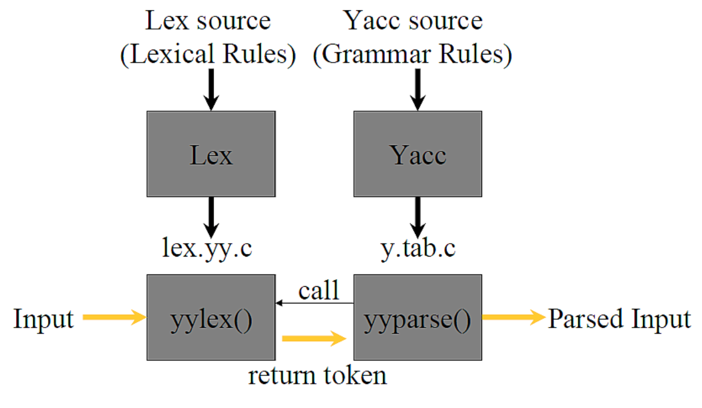
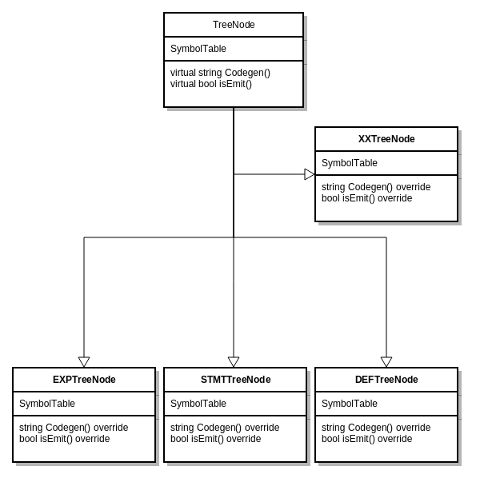
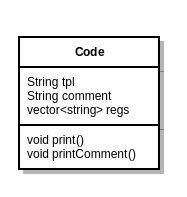
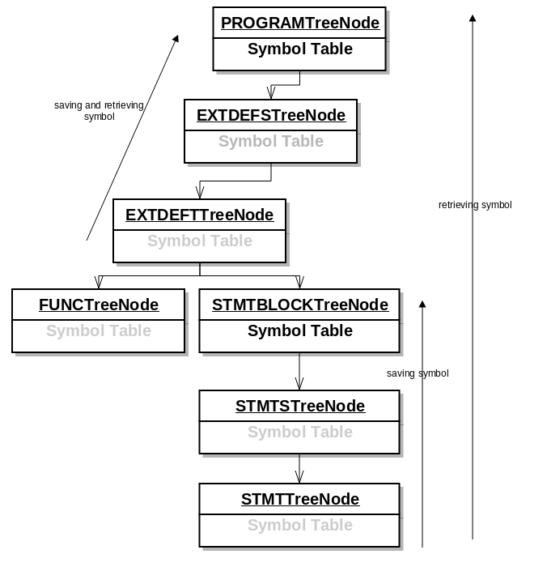

<body class="c19 c37">

Report of Compiler Principle

Project 2

<a class="c11" href="mailto:jiady@sjtu.edu.cn">Dongyu Jia (5120309607)</a>

01/20/2016 

<a class="c11" href="#h.shdwnr9f3k7t">Introduction</a>

<a class="c11" href="#h.q5igxepx5vkl">Lexical Analyzer</a>

<a class="c11" href="#h.vncwqeo2o4ts">Examples</a>

<a class="c11" href="#h.9ghbzfuszc2u">Line number</a>

<a class="c11" href="#h.p4lp2gr4fr92">Numbers</a>

<a class="c11" href="#h.9sfkd92liy1">Comments</a>

<a class="c11" href="#h.w2wmcxmmrbtk">Syntax Analyzer</a>

<a class="c11" href="#h.w62kvwc0uaoy">Precedence of IF and IF ELSE Statement</a>

<a class="c11" href="#h.eonp3nb1gbpn">Error Message</a>

<a class="c11" href="#h.rhouzduey44h">Node reduction and modification</a>

<a class="c11" href="#h.16njz18miwqn">Reduction</a>

<a class="c11" href="#h.y023xnqzlqmm">Modification</a>

<a class="c11" href="#h.abn9t5g9sh0w">Semantic Analyzer</a>

<a class="c11" href="#h.jfnevnw9gs19">Parse Tree Generation</a>

<a class="c11" href="#h.6m0yts5pj6rn">Examples</a>

<a class="c11" href="#h.83ca20x1oz22">Symbol Table</a>

<a class="c11" href="#h.950lxchkc2yw">Error Checking</a>

<a class="c11" href="#h.4ywx7ponh57g">Auto conversion</a>

<a class="c11" href="#h.8saj9xt5u3gu">operand type checking</a>

<a class="c11" href="#h.e8q4dzvon3j9">Resevered word</a>

<a class="c11" href="#h.v6llbveznqrz">Main entrance</a>

<a class="c11" href="#h.6187kdv3bs8s">Usage after declaration</a>

<a class="c11" href="#h.ixq27grp1roa">Break &amp; continue</a>

<a class="c11" href="#h.wqebhch71hcs">Intermediate Representation</a>

<a class="c11" href="#h.6vxrhwyr0bce">Data Structure</a>

<a class="c11" href="#h.wqebhch71hcs">Register Allocation</a>

<a class="c11" href="#h.wqebhch71hcs">Optimization</a>

<a class="c11" href="#h.e3u5r1ufj578">Unused function</a>

<a class="c11" href="#h.9cu2ru8y497k">Unused struct definition</a>

<a class="c11" href="#h.8a186ye4abu6">Conclusion</a>

<a class="c11" href="#h.5d1mbw6vzg4p">Philosophy</a>

<a class="c11" href="#h.2evc1faqyfiq">Reference</a>
<h1 class="c6 c22">Introduction</h1>
In this project, you are required to implement a code generator to translate the intermediate representation, which is produced by your syntax analyzer implemented in project 1, into LLVM instructions. Your code generator should return a LLVM assembly program, which can be run on LLVM (http://llvm.org/). After finishing this project, you will get a compiler, which can translate Small-C source programs to LLVM assembly programs.
<h1 class="c6 c22">Lexical Analyzer</h1>
Here we will use flex as the tool of lexical analyzer and we can work under the framework with only spcifying the regex expression and the according action.
<h2 class="c6 c22">Examples</h2>
Since the logic are pretty the same for all symbols, we use define to avoid duplicate and if you want to change some logic, you only need to fix the define instead of fixing them one by one.

<table cellpadding="0" cellspacing="0" class="c14"><tbody><tr class="c8"><td class="c30" colspan="1" rowspan="1">
#define&nbsp;printReturn(x)&nbsp; return&nbsp;x;

#define&nbsp;load yylval.string&nbsp;=&nbsp;strdup(yytext);

&hellip;...

&quot;/&quot;&nbsp;{load printReturn(DIV_OP)}

&quot;%&quot;&nbsp;{load printReturn(MOD_OP)}

&quot;&lt;&quot;&nbsp;{load printReturn(LT_OP)}
</td></tr></tbody></table>

<h2 class="c6 c22">Line number</h2>
For the debug purpose for me and for whoever use this compiler, it is very important that you tell user why and where it does not work.

<table cellpadding="0" cellspacing="0" class="c14"><tbody><tr class="c8"><td class="c30" colspan="1" rowspan="1">
[\n]&nbsp;{yylineno =&nbsp;yylineno+1;}
</td></tr></tbody></table><h2 class="c6 c22">Numbers</h2>
We will only handle positive value here, as for minus sign before it, we will handle it later in semantic analyzer. Note that we will treat number start with 0, and 0x, 0X as valid number. And alphabet will only appear in literals start with 0x or 0X.

<table cellpadding="0" cellspacing="0" class="c14"><tbody><tr class="c8"><td class="c30" colspan="1" rowspan="1">
([0-9]*|0[xX][0-9a-fA-F]+)&nbsp; &nbsp; &nbsp; &nbsp; &nbsp; {&nbsp;load printReturn(INT)&nbsp;}
</td></tr></tbody></table>

<h2 class="c6 c22">Comments</h2>
For comments, there are two formats.

one line comments is handled by such:

<table cellpadding="0" cellspacing="0" class="c14"><tbody><tr class="c8"><td class="c30" colspan="1" rowspan="1">
&quot;//&quot;(.)* &nbsp;{}
</td></tr></tbody></table>

And comments block will be handled by a more trick strategy which involves state transition:

<table cellpadding="0" cellspacing="0" class="c14"><tbody><tr class="c8"><td class="c30" colspan="1" rowspan="1">
%x COMMENT

...

&nbsp;&quot;/*&quot;&nbsp; &nbsp; &nbsp; BEGIN(COMMENT);

&lt;comment&gt;{

[^*]*&nbsp; &nbsp; &nbsp; &nbsp; 

&quot;*&quot;+[^*/]*&nbsp; &nbsp;

\n &nbsp; &nbsp; &nbsp; &nbsp; &nbsp; &nbsp; 

&quot;*&quot;+&quot;/&quot;&nbsp; &nbsp; &nbsp; &nbsp; BEGIN(INITIAL);// &nbsp; ******/

}
</td></tr></tbody></table>

<h1 class="c6 c22">Syntax Analyzer</h1>
In the file smallc.y, we define the syntax rules. We define precedence and translation rules. Along with which we also specify the structure of the node so that we can get a parse tree after parsing the file.
<h2 class="c6 c22">Precedence of IF and IF ELSE Statement</h2>
For expression IF LP EXPS RP STMT and IF LP EXPS RP STMT ELSE STMT, if we don&rsquo;t give them precedence, then the parser may have a confilct that may be both pattern can be used , so we need to specify the precedence that IF LP EXPS RP STMT ELSE STMT has higher priority than the other one.

<table cellpadding="0" cellspacing="0" class="c14"><tbody><tr class="c8"><td class="c30" colspan="1" rowspan="1">
%nonassoc &nbsp;IF_NO_ELSE

%nonassoc ELSE_AFTER_IF

&hellip;.

STMT: 

...

|&nbsp;IF LP EXPS RP STMT %prec IF_NO_ELSE {&nbsp;$$ =&nbsp;getNodeInstance(yylineno,&quot;STMT&quot;&nbsp;,&quot;STMT: if ( EXPS ) STMT&quot;,&nbsp;2,&nbsp;$3,$5);&nbsp;}

|&nbsp;IF LP EXPS RP STMT ELSE STMT %prec ELSE_AFTER_IF {&nbsp;$$ =&nbsp;getNodeInstance(yylineno,&quot;STMT&quot;,&nbsp;&quot;STMT: if ( EXPS ) STMT else STMT&quot;,&nbsp;3,&nbsp;$3,$5,$7);}
</td></tr></tbody></table>

<h2 class="c6 c22">Error Message</h2>
we override the error funciton yyerror that it will give the line number for better debug purpose.

<table cellpadding="0" cellspacing="0" class="c14"><tbody><tr class="c8"><td class="c30" colspan="1" rowspan="1">
void&nbsp;yyerror(char&nbsp;*s)

{

&nbsp;&nbsp;&nbsp;&nbsp;&nbsp;&nbsp;&nbsp;&nbsp;fflush(stdout);

&nbsp;&nbsp;&nbsp;&nbsp;&nbsp;&nbsp;&nbsp;&nbsp;fprintf(stderr,&quot;yyerror: %d :%s %s\n&quot;,yylineno,s,yytext);

}
</td></tr></tbody></table>

<h2 class="c6 c22">Node reduction and modification</h2><h3 class="c6 c22">Reduction</h3>
In the given material, there are some grammer like:

STSPEC &rarr;&nbsp;STRUCT OPTTAG LC DEFS RC |&nbsp;STRUCT ID

OPTTAG &rarr;&nbsp;ID |&nbsp;&#1013;

EXTDEF &rarr;&nbsp;SPEC EXTVARS SEMI |&nbsp;SPEC FUNC STMTBLOCK

SPEC &rarr;&nbsp;TYPE |&nbsp;STSPEC

STMT &rarr;&nbsp;IF LP EXP RP STMT ESTMT &nbsp;|&nbsp;...

ESTMT &rarr;&nbsp;ELSE STMT |&nbsp;&#1013;

I change the grammer by merging the rules. so that I can translate the code in a higher level of the grammer tree. I merge the rules to this:

STSPEC &rarr;&nbsp;STRUCT ID LC DEFS RC

&nbsp;&nbsp;&nbsp;&nbsp;&nbsp;&nbsp;&nbsp;&nbsp;|&nbsp;STRUCT LC DEFS RC

|&nbsp;STRUCT ID

EXTDEF &rarr;&nbsp;TYPE EXTVARS SEMI 

|&nbsp;TYPE FUNC STMTBLOCK

|&nbsp;STSPEC SEXTVARS SEMI //(by introtucing SEXTVARS to distinguish struct def)

STMT &rarr;&nbsp;IF LP EXP RP STMT &nbsp;

|&nbsp;IF LP EXP RP STMT ELSE STMT

|...
<h3 class="c6 c22">Modification</h3>
Since situation like if (EXP) will not be acceptable if EXP is empty, I introduce EXPS as such:

EXP -&gt;&nbsp;EXPS

|&nbsp;&#1013;

EXPS are defined as exp before but it can not be empty and modify if(EXP) to if(EXPS)
<h1 class="c6 c22">Semantic Analyzer </h1>
We use polymorphism as our main method in generating parse tree. Our Data structure is as such, there is a base class called TreeNode. And there are a lot of class inheriting the base class and will override the function Codegen() and isEmit();

Derived from the base class, we implement more than 20 derived class such as EXPTreeNode , STMTTreeNode etc. 

Function getNodeInstance will judge on the input argument and decide which kind of TreeNode class to return. And that class will have it&rsquo;s own implementation of Codegen(). When parent node is called function Codegen(), it can directly call children class to excute their Codegen() without knowing what kind of child class it is calling.

isEmit is for optimization purpose, if some class override the default function, then the node will be neglected if isEmit() function return false. This is for dead code elimination purpose.

Codegen() will generate code by pushing back Code class to a vector of code. Code is stored by lines or by instructions. It include template which idicate the instrcution selection, comment that for debug purpose and register used in instruction. In our implementation , comment will include the infomation of the path from the calling node to the root node. 
<h2 class="c6 c22">Parse Tree Generation</h2><h2 class="c6 c22">Examples</h2>
I will demostrate how for expression is constructed.

<table cellpadding="0" cellspacing="0" class="c14"><tbody><tr class="c8"><td class="c30" colspan="1" rowspan="1">
STMT:&nbsp; FOR LP EXP SEMI EXP SEMI EXP RP STMT {&nbsp;$$ =&nbsp;getNodeInstance(yylineno,&nbsp;&quot;STMT&quot;,&quot;STMT: for ( EXP ; EXP ; EXP ) STMT&quot;,&nbsp;4,&nbsp;$3,$5,$7,$9);&nbsp;}
</td></tr></tbody></table>

getNodeInstance will return a TreeNode class based on arguments, here we pass &ldquo;STMT&rdquo; into the function and this funciton will return a STMTTreeNode Class. And it will has 4 children, pointer of which will be represented as $3, $5, $7, $9. And the returned STMTTreeNode may be treated as a child by other TreeNode.

<h2 class="c6 c22">Symbol Table</h2>
Symbol table is stored in each TreeNode, we make this design to support the senario where same name appear in different layer of code like:

int&nbsp;a;

int&nbsp;main{

&nbsp;&nbsp;&nbsp;&nbsp;&nbsp;&nbsp;&nbsp;&nbsp;int&nbsp;a=0;

&nbsp;&nbsp;&nbsp;&nbsp;&nbsp;&nbsp;&nbsp;&nbsp;int&nbsp;c=0;

&nbsp;&nbsp;&nbsp;&nbsp;&nbsp;&nbsp;&nbsp;&nbsp;if(a=0){

&nbsp;&nbsp;&nbsp;&nbsp;&nbsp;&nbsp;&nbsp;&nbsp;&nbsp;&nbsp;&nbsp;&nbsp;&nbsp;&nbsp;&nbsp;&nbsp;int&nbsp;c=1;

}

return&nbsp;0;

}

Only STMTBLOCKTreeNode and PROGRAMTreeNode has meaningful symbol table, for other type of nodes, the symbol table should be empty.

As the figure suggests, when a node want to retrieving a symbol, it will first look up to the nearest STMTBOLCK node or PROGRAM node, and check if the symbol is in the table, if not find it, it will futher go to upper node until arrive root node.

For saving process, toward the root direction, it will save this symbol to the nearest symbol table.

The symbol table is resposible to make a map between the varible in smallc to a unique name in LLVM. And Symbol table in Program holds global variable, while Symbol table in STMTBOLCK holds local variable. Other node&rsquo;s symbol table will be empty. 
<h2 class="c6 c22">Error Checking</h2><h3 class="c6 c22">Auto conversion</h3>
For situation of &#65306;

if&nbsp;(exps)

for(exp;exp;exp)

The value inside if bracket and second value of exp should be a bool value, but generally in most grammer, int, string and other varible that are not empty or not zero will be concidered as true. Here after the calculation of the exps, we will do the auto conversion, if and i32 is returned , it will be compared to zero to generate a bool value.
<h3 class="c6 c22">operand type checking</h3><ol class="c33 lst-kix_o5amvn4w35l-0 start" start="1"><li class="c5">for Dot and [] , we will first check if the operand is valid or not. If it is not valid, we will log warning and exit the program.</li><li class="c5">for return statment, I will check if the return register is a i32 format.</li></ol><h3 class="c6 c22">Resevered word</h3>
Id can not be reserved word, this is implemented by the flex and yacc, it will treat reserve word a symbol and parse it by that symbol&rsquo;s way. It will generate an error in syntaxtree building process.
<h3 class="c6 c22">Main entrance</h3>
We will check is the function main exist after we finish parsing the code.
<h3 class="c6 c22">Usage after declaration</h3>
This part is implemented with symbol table, when encountered a symbol, it will try to retrive the symbol in the path of node toward the root. If no such symbol is found, it will generate a error message and exit with -1.
<h3 class="c6 c22">Break &amp; continue</h3>
We use a stack to maintain if program is inside a for loop, in each for loop, we will push the break label and continue label into the stack, when encounter a break or continue, it will first check if the stack is empty and then jump to the label on the top of the stack.

<h3 class="c6 c22">Function checking and Struct definition checking</h3>
When program call a funciton or declare a struct, we will check if it has been defined globally.
<h1 class="c6 c22">Intermediate Representation</h1><h2 class="c6 c22">Learning LLVM basic knowledge</h2>
&nbsp;
<table cellpadding="0" cellspacing="0" class="c14"><tbody><tr class="c8"><td class="c10" colspan="1" rowspan="1">
small c
</td><td class="c10" colspan="1" rowspan="1">
translation template
</td></tr><tr class="c8"><td class="c10" colspan="1" rowspan="1">
read
</td><td class="c10" colspan="1" rowspan="1">
%s = call i32 (i8*, ...)* @__isoc99_scanf(i8* getelementptr inbounds ([3 x i8]* @.str, i32 0, i32 0), i32* %s)

</td></tr><tr class="c8"><td class="c10" colspan="1" rowspan="1">
write (other funciton call are similar)
</td><td class="c10" colspan="1" rowspan="1">
%s = call i32 (i8*, ...)* @__isoc99_scanf(i8* getelementptr inbounds ([3 x i8]* @.str, i32 0, i32 0), i32* %s)

</td></tr><tr class="c8"><td class="c10" colspan="1" rowspan="1">
continue, break
</td><td class="c10" colspan="1" rowspan="1">
br label %%%s

</td></tr><tr class="c8"><td class="c10" colspan="1" rowspan="1">
return 
</td><td class="c10" colspan="1" rowspan="1">
ret i32 %s

</td></tr><tr class="c8"><td class="c10" colspan="1" rowspan="1">
int a
</td><td class="c10" colspan="1" rowspan="1">
%s = allocal i32, align 4

%s &nbsp;= common global i32 0, align 4
</td></tr><tr class="c8"><td class="c10" colspan="1" rowspan="1">
int a[4]
</td><td class="c10" colspan="1" rowspan="1">
%s &nbsp;= common global [ 4&nbsp;x i32] zeroinitializer, align 4

%s = alloca [ 4&nbsp;x i32] , align 4

</td></tr><tr class="c8"><td class="c10" colspan="1" rowspan="1">
struct a={ &hellip;}
</td><td class="c10" colspan="1" rowspan="1">
%s = type {i32, i32&hellip;} 
</td></tr><tr class="c8"><td class="c10" colspan="1" rowspan="1">
a=b
</td><td class="c10" colspan="1" rowspan="1">
%s= load i32* %b, align 4

save i32 %s , i32* %a, align 4
</td></tr><tr class="c8"><td class="c10" colspan="1" rowspan="1">
a+b (other binary operation is similar)
</td><td class="c10" colspan="1" rowspan="1">
%s = add i32 %1, %2
</td></tr><tr class="c8"><td class="c10" colspan="1" rowspan="1">
a==b (other compare operation is similar)
</td><td class="c10" colspan="1" rowspan="1">
%s = icmp eq i32 %a, %b
</td></tr><tr class="c8"><td class="c10" colspan="1" rowspan="1">
++a (other unary operand is similar)
</td><td class="c10" colspan="1" rowspan="1">
%a= load i32* %ptr_a, align 4

%s =add i32 %a, 1

save i32 %s, i32* %ptr_a 
</td></tr></tbody></table><h2 class="c6 c22 c34"></h2><h1 class="c6 c22">Register Allocation</h1>
Alougth llvm can have infinite variables and llvm will do register allocation inside it, we still do register allocation for practice.

Note that llvm does not allow the following grammer:

%r3 =&nbsp;add i32 %r1,&nbsp;%r2

&hellip;.

%r3 =&nbsp;add i32 %r1,&nbsp;%r4

This means that one variable can only be assigned a value once. Because of that I named my register with two parts like: %r_45.fp323. The first part is %r_45, meaning that it is a register, and it is register 45, fp323 is short for figerprints 323. Finger prints is to make sure that the register is not the same for llvm. But if we are going to help llvm implement register allocation, then the fingerprint part can be neglected. 

There are three cases where we need to handle register.
<ol class="c33 lst-kix_ys1gkzcwbzip-0 start" start="1"><li class="c5">read/write return value.</li></ol><ol class="c33 lst-kix_ys1gkzcwbzip-1 start" start="1"><li class="c6 c35">when read and write are called, a function call will return a int. And that int will be abandoned.</li></ol><ol class="c33 lst-kix_ys1gkzcwbzip-0" start="2"><li class="c5">EXP calculation</li><li class="c5">initialization of the array,</li></ol><ol class="c33 lst-kix_ys1gkzcwbzip-1 start" start="1"><li class="c6 c35">we need to first get the pointer to the value</li><li class="c6 c35">then store value to that pointer, after that this pointer is of no use.</li></ol>

For first and third situation, since they will be abandoned after one time use. They will handled by adhoc method. We do register allocation for the second situation.

Our register allocation Algorithm is like this:
<ol class="c33 lst-kix_kph9ph6y19yr-0 start" start="1"><li class="c5">we maintain an int registerNumber and set&lt;stirng&gt; freeRegister.</li><li class="c5">if freeReg is called, then the reg is add to freeRegister.</li><li class="c5">if allocateReg is called, then it will give the first element of freeRegister(also the smallest one since set is implemented as BST) if freeRegister is empty then increment registerNumber and return a newly created name.</li></ol>

freeReg is called by the programmer who write the compiler (i.e me). basically I will freeReg all regs except the return one when finish the calculation of the EXPS. 
<h1 class="c6 c22">Optimization</h1><h2 class="c6 c22">Unused function</h2>
For unused funciton , I will directly remove that EXTDEFSTreeNode.
<h2 class="c6 c22">Unused struct definition</h2>
For unused struct definition, I will directly remove that EXTDEFSTreeNode.
<h1 class="c6 c22">Conclusion</h1>
My compiler has passed the given test and <a class="c11" href="https://www.google.com/url?q=https://github.com/jiady/compiler-llvm/tree/master/5120309607_prj2/testcase/new_test&amp;sa=D&amp;ust=1453306343846000&amp;usg=AFQjCNGbSFh09_ifV-lMxB7gJvcVGhUIEw">other test</a>&nbsp;like quicksort, prime number, recursive if , and int array test.

My program is published in github: <a class="c11" href="https://www.google.com/url?q=https://github.com/jiady/compiler-llvm&amp;sa=D&amp;ust=1453306343847000&amp;usg=AFQjCNFfRMW_HN8R8odg-JAf8SLY1UXeTg">https://github.com/jiady/compiler-llvm</a>. Feel free to download, comment or modify it.

You can see the commit history here: <a class="c11" href="https://www.google.com/url?q=https://github.com/jiady/compiler-llvm/commits?author%3Djiady&amp;sa=D&amp;ust=1453306343848000&amp;usg=AFQjCNFudcD8IZ_pBDv3sOtjWv4vBnU-Mw">https://github.com/jiady/compiler-llvm/commits?author=jiady</a>
<h2 class="c6 c22">Philosophy</h2><h3 class="c6 c22">Programing for debug</h3>
At the very begining I realize that this is such a big project that without a great debug method it will be very hard for me to make it. I have majorly two way on this.
<ol class="c33 lst-kix_stvb7tzzd7w-0 start" start="1"><li class="c5">I make plenty of log and comment in generated llvm code to make sure every move is correct. Every generated code is along with a comment that indicate structure infomation of the parse tree. And I can easily see the parents of that node and so on.</li><li class="c5">I check the assumptions before doing any logic, for example I will check if this node&rsquo;s number is correct, if the content is valid. I check like content==&rdquo;STMTBLOCK: XXXXX&rdquo; instead of content.at(0)==&rsquo;S&rsquo;. What I want to do is to make every move clear. I will check if I can&rsquo;t find a valid symbol or some symbol is duplicate. I will exit immediately &nbsp;instead of letting the program running on errors.</li></ol><h3 class="c6 c22">Avoid duplication</h3>
It is common that some logic may need to be changed against the design during coding. And it will be painful if you write the same logic code for hundrends of times. When you need to change it , you will find it is impossible.
<ol class="c33 lst-kix_ncdzgknfaotx-0 start" start="1"><li class="c5">I use a lot of #define and helper funtion to avoid duplication.</li><li class="c5">Why polymorphism? why not simple if else to decide calling which funtion to generate code. The quesiton should be asked as why the same infomation need to be given twice? The tree structure is given in the syntax tree already, why should you use if else to judge it again? So polymorphism is used to avoid duplication and make it more elegant.</li></ol>

<h3 class="c6 c22">Design before you start coding</h3>
If you do not have a big picture(design) and start coding, believe it or not, you are writing shit.
<h1 class="c6 c22">Reference</h1>
<a class="c11" href="https://www.google.com/url?q=http://www.cs.sjtu.edu.cn/~jiangli/teaching/CS308/projects/LexIntroduction.pdf&amp;sa=D&amp;ust=1453306343851000&amp;usg=AFQjCNHyXjkyZCviqi-j87ZmNSm1bl0T8A">http://www.cs.sjtu.edu.cn/~jiangli/teaching/CS308/projects/LexIntroduction.pdf</a>

<a class="c11" href="https://www.google.com/url?q=http://www.cs.sjtu.edu.cn/~jiangli/teaching/CS308/projects/SetupEnvironment.pdf&amp;sa=D&amp;ust=1453306343852000&amp;usg=AFQjCNEEhXuUPb-Fd_FTiudeotPevqvZNw">http://www.cs.sjtu.edu.cn/~jiangli/teaching/CS308/projects/SetupEnvironment.pdf</a>

<a class="c11" href="https://www.google.com/url?q=http://www.cs.sjtu.edu.cn/~jiangli/teaching/CS308/projects/YaccIntroduction.pdf&amp;sa=D&amp;ust=1453306343853000&amp;usg=AFQjCNEGTrIP9uFGstEEa5xofMoA9NYuIg">http://www.cs.sjtu.edu.cn/~jiangli/teaching/CS308/projects/YaccIntroduction.pdf</a>

<a class="c11" href="https://www.google.com/url?q=http://www.cs.sjtu.edu.cn/~jiangli/teaching/CS308/projects/project2.pdf&amp;sa=D&amp;ust=1453306343853000&amp;usg=AFQjCNHRbSZVofKgXIiTZXvvXcOWyVrw7w">http://www.cs.sjtu.edu.cn/~jiangli/teaching/CS308/projects/project2.pdf</a>

<a class="c11" href="https://www.google.com/url?q=http://www.cs.sjtu.edu.cn/~jiangli/teaching/CS308/projects/project1.pdf&amp;sa=D&amp;ust=1453306343854000&amp;usg=AFQjCNHE_1Llz1TtmZdmxzTAsO2qbKBfHA">http://www.cs.sjtu.edu.cn/~jiangli/teaching/CS308/projects/project1.pdf</a>

<a class="c11" href="https://www.google.com/url?q=http://www.cs.sjtu.edu.cn/~jiangli/teaching/CS308/projects/LLVMIntroduction.pdf&amp;sa=D&amp;ust=1453306343855000&amp;usg=AFQjCNG57N_OLt-vRBEuuD-j7_U8XbKMfA">http://www.cs.sjtu.edu.cn/~jiangli/teaching/CS308/projects/LLVMIntroduction.pdf</a>

<a class="c11" href="https://www.google.com/url?q=http://www.cs.sjtu.edu.cn/~jiangli/teaching/CS308/projects/ProjectIntroduction.pdf&amp;sa=D&amp;ust=1453306343855000&amp;usg=AFQjCNEgyoLM5xFAv9yWGT0au296D4-4RA">http://www.cs.sjtu.edu.cn/~jiangli/teaching/CS308/projects/ProjectIntroduction.pdf</a>

<a class="c11" href="https://www.google.com/url?q=https://github.com/BinaryMelody/Compiler_Principle&amp;sa=D&amp;ust=1453306343856000&amp;usg=AFQjCNFehBkhEetEJqS-pNfmdvdt2Rbz-w">https://github.com/BinaryMelody/Compiler_Principle</a>

<a class="c11" href="https://www.google.com/url?q=https://github.com/vendisky/Compiler-Principles-Project-2&amp;sa=D&amp;ust=1453306343857000&amp;usg=AFQjCNEsyZGfwS0ft9Qy_8clJ5vEWxN4YQ">https://github.com/vendisky/Compiler-Principles-Project-2</a>

<a class="c11" href="https://www.google.com/url?q=https://github.com/linzebing/compiler&amp;sa=D&amp;ust=1453306343857000&amp;usg=AFQjCNGqPhR_YBFqSZ_49jjfLrL07hALxg">https://github.com/linzebing/compiler</a>

<a class="c11" href="https://www.google.com/url?q=http://llvm.org/docs/LangRef.html&amp;sa=D&amp;ust=1453306343858000&amp;usg=AFQjCNHXrtnRn6BiIumg1tGLHCPlR-gmEw">http://llvm.org/docs/LangRef.html</a>

/

</body></html>
